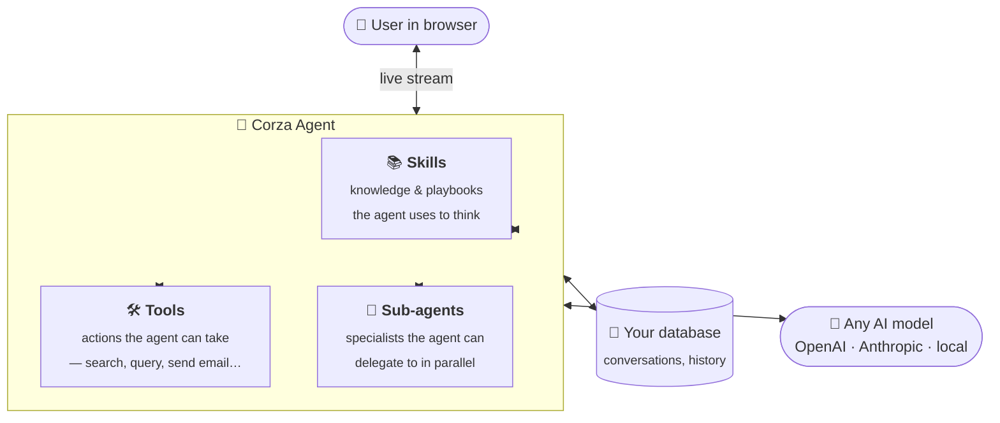

  

<h1 align="center">Corza Agent Framework</h1>

  <strong>The fastest way to put a real AI agent inside your web app.</strong>

  
  
  

---

## What is this?

Corza is a toolkit for building **AI agents that live inside real products** — the kind your users log into, click around in, and pay for.

Think of an agent as an AI assistant that doesn't just chat, but actually **does things**: looks up information, runs reports, sends emails, fills in forms, talks to other systems. Corza handles all the unglamorous-but-essential machinery that makes this work in production:

- Remembering conversations between visits
- Streaming the agent's thinking to the user's browser in real time
- Keeping each customer's data separate
- Handling failures without losing the user's work
- Coordinating multiple specialist agents on bigger jobs

You focus on **what your agent should do**. Corza handles **how it stays alive in a real app**.

---

## Why does it exist?

Almost every AI agent framework out there — Claude Agent SDK, LangChain agents, AutoGen, CrewAI — was built to run **on your local computer**. They read and write files on your laptop. They expect a terminal. They assume one user (you). They're brilliant for personal automation, research scripts, and coding assistants.

But the moment you want to put an agent **inside a real web product** — a SaaS app, a customer portal, an internal tool — none of that translates. There's no filesystem to read from. There are hundreds of users, each with their own data. The agent has to stream to a browser, survive a server restart, and never let one user see another user's conversation.

**Corza is the first agent framework designed from day one for web applications.**

It's a plug-and-play library: install it, point it at your database, and you immediately have a working AI agent backend — with streaming, persistence, multi-user isolation, and team-of-agents orchestration. No filesystem assumptions. No "single user" assumptions. No DIY plumbing.

---

## How is it different?

Most agent frameworks are **AI-first** — they think of themselves as a way to call language models, with the app being an afterthought.

Corza is **app-first**. It assumes you already have a product, users, a database, and a frontend, and its job is to slot AI into the world you already built.

|  | Typical agent frameworks | **Corza** |
|---|---|---|
| Designed for | Scripts and notebooks | Real web apps with real users |
| Conversations | Live in memory, vanish on restart | Saved to your database automatically |
| Streaming | "You can add that yourself" | Built in, works in any browser |
| Multi-user | Not a concern | Every conversation is scoped to a user and a workspace |
| Reliability | One error ends the chat | Auto-retries, fallback providers, recoverable sessions |
| Teams of agents | Wire it up yourself | A coordinator can run specialists in parallel |
| AI provider | Pick one, get married to it | Swap between 23+ providers with a single line |

---

## Who is it for?

Corza is for you if you're building **any of these**:

- 🧑‍💼 An **AI copilot** inside your SaaS product
- 🔍 A **research or analytics assistant** that digs through your data
- 🤖 A **customer support agent** that handles real tickets
- 📊 An **internal tool** that automates work for your team
- 🧠 A **multi-agent system** where specialists collaborate on complex tasks

…and you'd rather spend your time on **what makes your agent special**, not rebuilding session storage and SSE streaming for the hundredth time.

---

## What you get out of the box

- 🌐 **A ready-made API** for starting conversations, sending messages, and streaming replies — no glue code required.
- 💾 **Conversation memory** that survives restarts, deploys, and a customer coming back next Tuesday.
- ⚡ **Live streaming** so your users see the agent thinking word-by-word, just like ChatGPT.
- 👥 **Multi-tenant by default** — every user, every workspace, fully isolated.
- 🛟 **Graceful failure handling** — rate limits, timeouts, dead providers, all handled for you.
- 🔀 **Any AI provider** — OpenAI, Anthropic, Google, plus free local models. Swap any time.
- 🤝 **Teams of agents** — let a coordinator delegate to specialists who work in parallel.
- 📅 **Scheduled agents** — run an agent every morning at 9, or on any cron schedule.
- 🔐 **Production-ready security** — permissioned tools, auditing, rate limiting all built in.

---

## What it doesn't do

Corza is deliberately not a low-code AI builder. It's a developer library. You will write Python.

It also does **not** handle:

- **Login and authentication** — your app already does that; Corza just respects whoever you say is logged in.
- **The AI itself** — it talks to OpenAI, Anthropic, and others. You bring your own API key.
- **A frontend** — you build the chat UI; Corza streams the data to it.

That's intentional. Corza does one thing — make agents work inside real apps — and tries to do it really well.

---

## How does it work?

An agent in Corza is made of three things — **skills** (what it knows how to do), **tools** (the actions it can take), and optionally **sub-agents** (specialists it can call on). Your web app sends the user's message in, Corza orchestrates the agent's reasoning, and streams the reply back to the browser.

You describe the agent in a few lines — what it's called, which AI model to use, which tools and skills it has. Corza turns that into a fully working backend with streaming, persistence, and multi-user support. The framework gets out of your way and lets you focus on **what your agent does**, not the wiring.

---

## Where to go next

- 🚀 **[Getting started](docs/getting-started.md)** — install it and run your first agent in 5 minutes.
- 🏗️ **[Architecture](docs/architecture.md)** — see how the pieces fit together.
- 🎓 **[Skills & knowledge](docs/skills.md)** — give your agent a personality and domain expertise.
- 📦 **[Examples](examples/)** — four small, runnable apps from "hello world" to a full chat UI.
- 📝 **[Changelog](CHANGELOG.md)** — what's new.

---

## A word on maturity

Corza powers production AI features at [Corza](https://corza.ai) and is under active development. The API is stable, the test suite has 235+ tests across 26 files, and the framework supports Python 3.11+.

If you find a rough edge, [open an issue](https://github.com/Corza-AI/corza-agent-framework/issues) — we read every one.

---

## License

MIT. Use it for anything, including commercial products. See [LICENSE](LICENSE).
